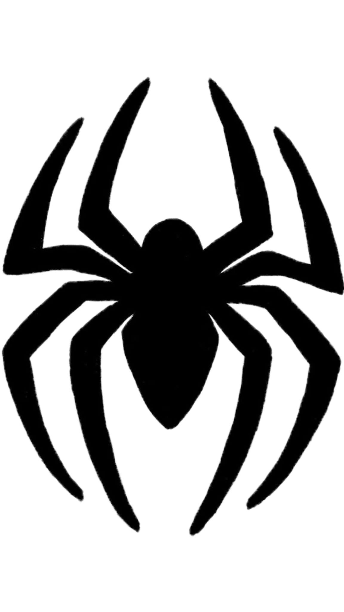
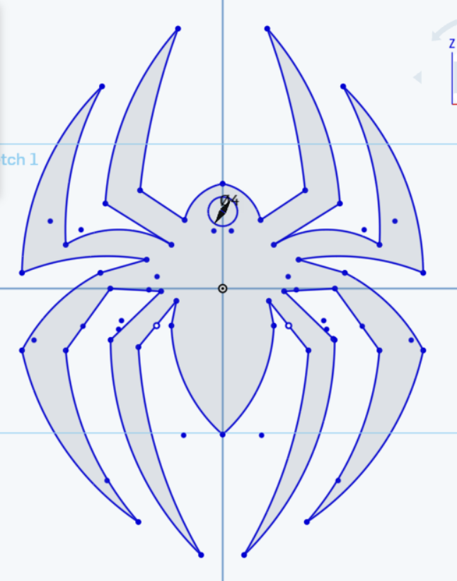

# spiderman-keychain-3d-design

## Introduction

In this task, I created a spiderman logo shaped keychain using Onshape. I used an image from the internet as a reference, estimated the measurments, drew it, added a hole for the keyring, and converted the sketch into a 3D model (extruded).

## Task Requirements

The design includes:

- A spider shape based on a reference image
- A circular keyring hole with a size of 4 mm
- An extrusion of 2 mm
- An STL file for the final model

## Tools Used

- Onshape:
- Sketch tools
- Mirror tool
- Extrude tool

## Design Process

First, I drew the left side of the logo to match the refrence photo then used the Mirror tool to create the other side and keep the design symmetrical.

After completing the outline, I added a circular hole with a diameter of 4 mm. The final sketch was extruded by 2 mm to create the 3D model.

## Reference Image

## Final Sketch

the completed sketch before extrusion:

## Final Design

the finished model from different angles:

## Side Views

The following images show the thickness and side appearance of the model:

## Onshape design link
[press here for the link](https://cad.onshape.com/documents/ad95bdd1d24713efca2368cc/w/a7e079f04b57cf2f2505121e/e/1b118aaf9da5a1ccc4d74753?renderMode=0&uiState=6a5f160c88d8f2adc764185c)
## STL File

The final design was exported in STL format.

[Download the STL file](spider_keychain.stl)

## Result

The spider keychain was completed successfully. The final model includes the required 4 mm keyring hole and a thickness of 2 mm.
